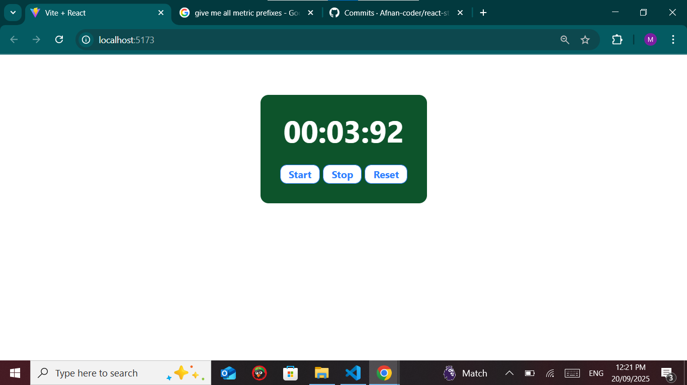

# React Stopwatch ⏱️

A simple stopwatch built with **React** and **TailwindCSS**.  
It supports **Start, Stop, and Reset** functionality and displays time in `minutes:seconds:milliseconds` format.

---

## 🚀 Features
- Start, stop, and reset stopwatch
- Time formatting (MM:SS:MS)
- Built with React hooks (`useState`, `useRef`)
- Styled using TailwindCSS with responsive, modern design

---

## 🛠️ Technologies Used
- React (Vite or CRA)
- TailwindCSS
- JavaScript (ES6+)

---

## 📸 Screenshot



---

## ⚙️ Installation & Setup
1. Clone this repository:
   ```bash
   git clone https://github.com/Afnan-coder/react-stopwatch.git
   npm run dev
